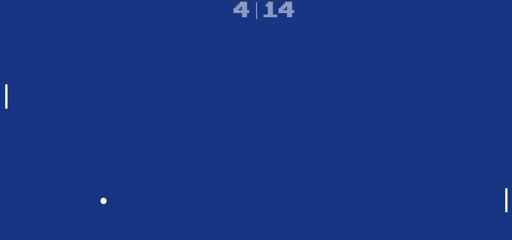
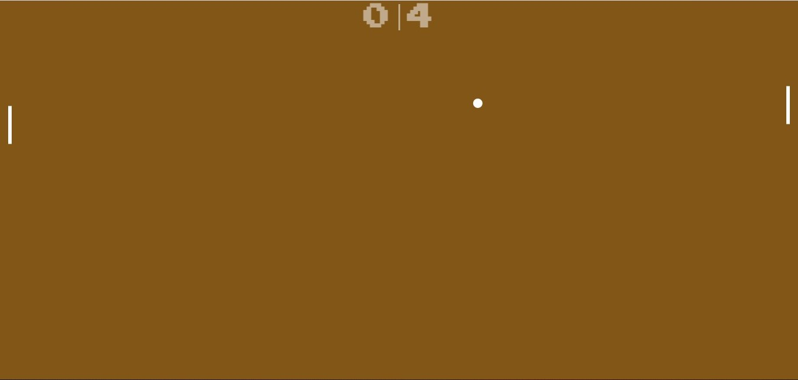
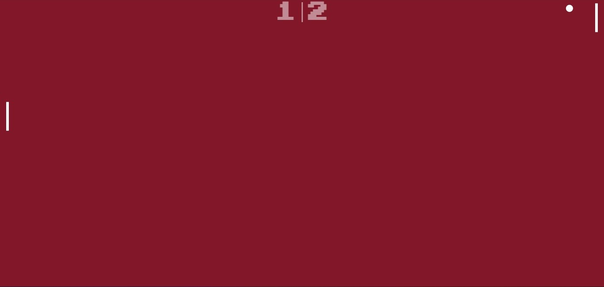

# PONG VIDEO GAME 

<div align="center">
    
    
    
</div>

***



Written with Vanilla Javascript, HTML and CSS.

Click [here](https://github.com/callumgordon90/Pong-Video-Game) to download the repository to your device and play the game!

-------------------
# Summary of the project


 DISCLAIMER:  I made this project by following a tutorial on Web Dev. It is NOT an original creation by me, but rather something I made following and improving upon a pre-existing guide in order to learn and improve my own skills as a programmer. 

--------------

This is a video game (Pong clone) which I made with Vanilla Javascript, HTML and CSS. The frames of animation are updated continiously on a loop, and there are seperated functions to control the movement of the ball, the paddles and to update the score as well as take in inputs from the mouse.

I did this project because I wanted to improve my understanding of Javascript; both the syntax and structure of the language, as well as how to use functions to create interactivity and change the output which is displayed to the client. 

It was an interesting project for me which taught me quite a few new things and I will continue to make more in the future!

The game contains the following functions:

* A player paddle controlled by the user's mouse
* A computer paddle controlled by a basic ai algorithm (it tracks the movement of the ball but at a slightly delayed speed so as to give the player the possibility of defeating it)
* The ball which moves in the general opposite direction of whatever comes into contact with it, albeit at a slightly randomised angle.
* The ball increases in speed after each hit so as to make the game more fun
* The background screen constantly changes colour moving through a spectrum of colours as the game is running
* The score updates after each goal and the ball resets itself in the centre
* There is background music which will run automatically (depending on the browse of the user)


***

.. note how the background changes colour

***

..a furious game of Pong in motion!

***

.. note how the score updates itself
***


## Pre-requisites for the project to run on your local computer:


* Clone the project on your computer with gitbash:
```
$git clone 'url-from-repository'
```


* Open with Live Server to display and play the game:
```
right click on 'index.html' and click 'open with Live Server'
```
***

## Technologies used in the project:
```
* **html**: Markup language to display everything
```

```
* **css**: to design the elements used in the game
```

```
* **javascript**: to add interactivity
```


## Explanation of the structure of the project

The **Ball.js** file contains all of the javascript code for the ball element. 

* The **Paddle.js.**: file contains all of the javascript code for the paddle element. Seperating the code out in this way and dividing the paddle and the ball into their own files makes everything easier to read and understand. 

* **script.js**: The master file of the javascript elements. The functions to control ball movement, update score, change background colour automatically, and receive mouse inputs are all defined here.

* **index.html**: This file connects everything together. It imports all the javascript elements and displays them on the screen, changing and updating the display constantly to map the movement of the ball, paddles and changing score


***
```
I hope you enjoy playing this as much as I enjoyed making it!

-----------------------------------

by Callum Gordon

---------------------